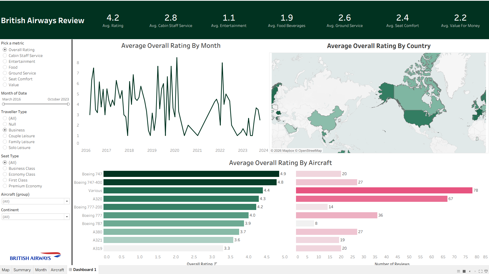

# British Airways Customer Review Analysis Dashboard

## Project Overview
This project analyzes British Airways customer reviews using Tableau to uncover passenger satisfaction patterns.

## Key Insights
- Monthly trend of average ratings
- Country-wise review distribution
- Aircraft-wise performance analysis
- Number of reviews by aircraft
- Customer segmentation by traveller type and seat type

## Files Included
- Airline_Dashboard_Project1.twbx
- ba_reviews.csv
- Countries.csv
- Dashboard Screenshot.png

## Tools Used
- Tableau
- CSV
- Data Visualization

## Tableau Public Link
Paste your Tableau Public dashboard link here

## Dashboard Preview

